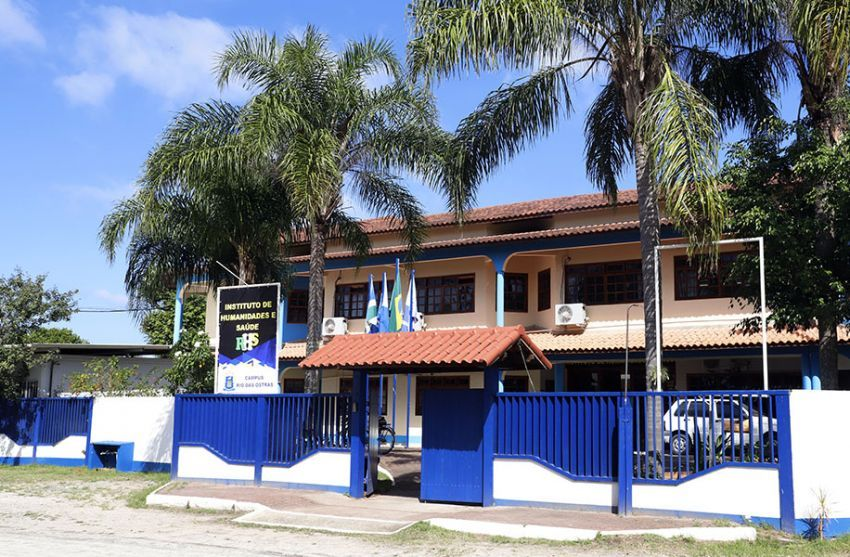

Professor Associado 3\
[Universidade Federal Fluminense](http://www.uff.br) \
[Departamento de Ciências da Natureza](http://depcienciasdanatureza.uff.br/departamento/)\
Campus de Rio das Ostras

{width=90%}

---

### Turmas Atuais -- 2026-1

- [Cálculo III-A](/calculoIII/2026-1/c3-A-2026-1.qmd)

- [GAAL](/gaal/gaal-2025-2/gaal-2026-1.qmd)

- [EDP II](/EDP2/2026-1/edp2-2026-1.qmd)

||Segunda|Terça|Quarta|Quinta|Sexta|
|-------|:------:|:------:|:------:|:------:|:------:|
|9h - 11h|   Cálculo III-A     Sala 5   ICT|    Cálculo III-A      Sala 5   ICT| | | |
|11h - 13h|  GAAL     Sala 5   IHS|  GAAL     Sala 5   IHS| | |    
|11h - 13h| | |  EDP II     SL 407 Blc H   (Niterói) | | |

: {.striped .table-sm}

### Links úteis 

- [Calendário UFF](https://www.uff.br/wp-content/uploads/2025/11/RESOLUCAO-CEPEX-5309_12-11-2025_CALENDARIO-ESCOLAR-E-ADMINISTRATIVO-2026.pdf)
    - 1º Período letivo: 09/03/2026 a 10/07/2026.
    - 2º Período letivo: 03/08/2025 a 11/12/2025.

- [iduff](https://app.uff.br/iduff/)

- [Quadro de Horários](https://app.uff.br/graduacao/quadrodehorarios)

- [Quadro de Alocação de salas do ICT](http://200.159.243.250:8010/index.php/segunda/) 

- [Quadro de Alocação de salas do IHS](http://159.112.185.66/home/index_simples)
    - [acesso por celular](http://159.112.185.66/home_externo/index)

- [Agendamento de Salas IHS]( http://159.112.185.66/agendamento.html)

- [Regulamento dos cursos de graduação -- Resolução CEPEx nº 001/2015](https://www.uff.br/wp-content/uploads/2023/10/001-2015_regulamento_do_curso_de_graduacao_0.pdf?q=regulamento-dos-cursos-de-graduacao-no-grupo-graduacao-regulamento-dos-cursos-de-graduacao-no-grupo)

---

### Formação Acadêmica/Titulação

-   04/2001 -- 03/2006: Licenciatura em Matemática pela UFV.

-   03/2006 -- 03/2008: Mestrado em Matemática pela UFF\
 Dissertação:  [ Equação de Boussinesq em domínios cilíndricos e não-cilíndricos](http://www.dominiopublico.gov.br/pesquisa/DetalheObraForm.do?select_action=&co_obra=159241)

-   03/2008 -- 08/2011: Doutorado em Matemática pela UFMG\
Tese: [Existência e não existência de soluções para uma classe de problemas elípticos com potencial singular](https://repositorio.ufmg.br/handle/1843/EABA-8LUS26).

-   2015 -- 2016: Pós-doutorado em Matemática pela Universidad de Sevilla.

### Pesquisa

- Linhas de Pesquisa
  -   Equações Diferenciais Parciais - EDP

  -   Controlabilidade de Equações Diferenciais Parciais

- [Grupo de Pesquisa CNPq](http://dgp.cnpq.br/dgp/espelhogrupo/8734602523044835)

- [Pós-Graduação IME-UFF](https://pgmat-uff.com.br/)

- [Publicações](research.qmd)

[Orcid](https://orcid.org/0000-0001-6891-7665), [Research Gate](https://www.researchgate.net/profile/Reginaldo_Demarque), [Lattes](http://lattes.cnpq.br/1924503823576120), [Gooogle Scholar](https://scholar.google.com.br/citations?user=taNb4t4AAAAJ&hl=pt-BR&oi=ao)

<link rel="me" href="https://ursal.zone/@reginaldodr"> </link>
